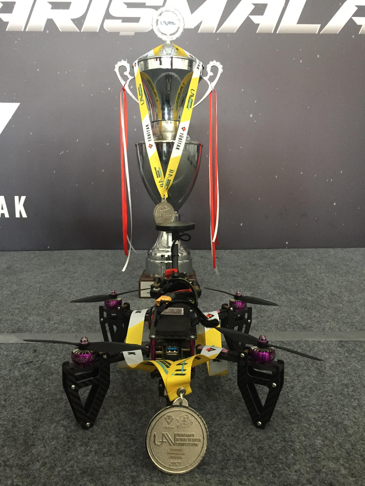

# Simulab İHA - TEKNOFEST 2021 International UAV Competition

This repository contains the complete source code for the Simulab İHA team from Yıldız Technical University, developed for the TEKNOFEST 2021 International UAV Competition. This project was awarded second place in the Rotary Wing category.




## Project Overview

This project is an autonomous quadcopter built on a Pixhawk flight controller and programmed in Python using the DroneKit library. The system is designed to execute two complex missions fully autonomously, integrating advanced navigation with real-time computer vision for object detection and payload delivery. The code in this repository is specifically structured for Mission 2.

The primary missions as defined by the competition are:

* **Mission 1:** A fully autonomous flight through a predefined route, demonstrating speed, maneuverability, and navigational accuracy.
    * [Watch the Mission 1 Flight Video on YouTube](https://youtu.be/tKhEEr0zPFk?si=F2UuWZGv5OIh-9Cj)

* **Mission 2:** A dynamic mission requiring the drone to:
    1.  Visually search for and identify a specific red circular target area on the ground.
    2.  Navigate to a designated pool to collect a water payload.
    3.  Fly to the previously identified target's coordinates.
    4.  Perform a high-precision final alignment using its camera before dropping the water directly onto the target.


## System Architecture

The software is designed with a modular architecture to ensure clarity and maintainability.

```bash
/
├── src/
│   ├── drone/          # Core drone connection and action wrappers.
│   ├── missions/       # High-level logic for mission sequences.
│   ├── vision/         # Real-time target detection module.
│   ├── utils/          # Helper functions for math and MAVLink commands.
│   ├── config.py       # Central configuration for all parameters.
│   └── main.py         # Main application entry point.
├── assets/             # Images
├── .gitignore
├── README.md
└── requirements.txt
```

## Setup

1.  **Clone the repository:**
    ```bash
    git clone https://github.com/emrecandir9/teknofest-uav.git
    cd teknofest-uav
    ```

2.  **Create and activate a virtual environment (recommended):**
    ```bash
    python -m venv venv
    source venv/bin/activate  
    ```

3.  **Install dependencies:**
    ```bash
    pip install -r requirements.txt
    ```

## Usage

The main entry point is `src/main.py`. This script should be run from the project's root directory.

* **To run with the SITL simulator on Mission Planner (default):**
    ```bash
    python -m src.main
    ```

* **To connect to a physical vehicle via a serial port:**
    ```bash
    python -m src.main --connect /dev/ttyACM0
    ```

## License

This project is licensed under the MIT License - see the `LICENSE` file for details.
